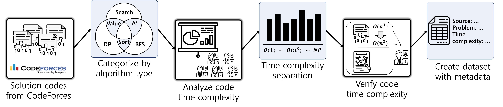

# CodeComplex: Code Complexity Prediction Dataset
By Seung-Yeob Baik, JoongHyuk Hahn, Mingi Jeon, Sang-Ki Ko and Yo-Sub Han\
Theory of Computation Lab., Yonsei University & Theory of Computation Lab., Kangwon Natinoal University

## Summary

Deciding computational complexity of algorithms is a really challenging problem even for human algorithm experts. Theoretically, the problem of deciding computational complexity of a given program is undecidable due to the famous Halting problem. In this paper, we propose to solve the problem using a deep learning-based approach by designing a neural network that comprehends the algorithmic nature of codes and estimates the computational complexity in the worst-case. First, we construct the code dataset called the CodeComple that consists of 3,500 Java codes submitted to programming competitions by human programmers with accurate complexity labels annotated by a group of algorithm experts. Then, we present several baseline algorithms using previous code understanding neural models such as CodeBERT, CuBERT, TreeBERT and so on. Lastly, we suggest our strong baseline model which is able to learn the compositional nature of codes by hierarchical neural architecture and data augmentation techniques for transforming a code while preserving the complexity of the implemented algorithm.

## Dataset Information

Our dataset is inspired from the recently revealed AlphaCode. We constructed a dataset with the codes from the coding competition platform Codeforces. The dataset contains 3,817 codes on 7 classes, where each class has around 500 codes each. The seven classes are constant, linear, quadratic, cubic, $\log n$, $n \log n$ and NP-hard.

The figure above illustrates the process of
the CodeComple dataset generation. For the first procedure we
collect problems and solutions codes from CodeForces. The solution
codes have correct solutions and wrong solutions, and have multiple
programming languages. We filter the correct Java codes as our
statistical population.
Before analyzing the time complexity of each problem, we divide the
problems by the problems solving strategy. This is because it helps
the human annotators to analyze the time complexity, and problems 
with similar solving strategy tend to have similar time complexity.
On the third procedure human annotators inspect the problem and 
solution codes to label each code by their time complexity. Each of
the human annotators have over 5 years of experience on solving
algorithm problems with various programming languages. Each data of
CodeComple dataset comes from algorithm problems and is a algorithm
implementation that solves the corresponding problem. With the
expertise in algorithms and programming languages, human annotators
label each code to its corresponding complexity class.
Algorithm problems have properties that can alter the complexity of
their solution algorihtm implementations.
We, therefore, provide the specific guideline to provides instructions and precautions for labelling the data.

After the labelling, we use different programming experts to
verify the class of each data that the human annotators assigned.
The verification includes checking the precautions that are included
in the guideline.

## Prerequisites

## Download

## Reference

To reference our work, please use the following paper.

    @article{JeonBHHK22,
        author  = {Mingi Jeon and Seung-Yeop Baik and Joonghyuk Hahn and Yo-Sub Han and Sang-Ki Ko},
        title   = {{Deep Learning-based Code Complexity Prediction}},
        year    = {2022},
    }

## License

The code is licensed under the Apache 2.0 License.

All non-code materials provided are made available under the terms of the CC BY 4.0 license (Creative Commons Attribution 4.0 International license).

We gratefully acknowledge the contributions of the following:
- DeepMind CodeContests dataset from https://github.com/deepmind/code_contests
